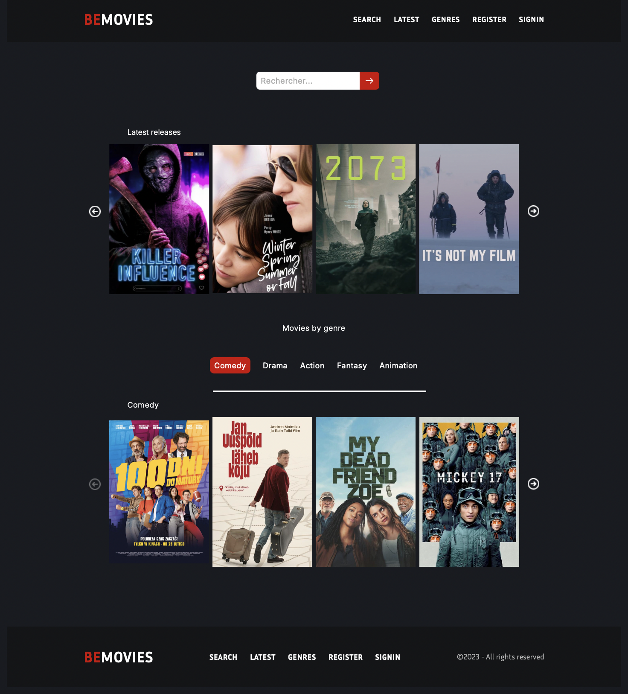

# 🎬 Film Project

## description 
BeMovies is an interactive web app designed for movie.It enables users to explore new films, search by title, and filter by genre. Each movie listing includes essential details such as:  
📖Synopsis  
🗓️​ Release Year  
🎬 Genre  
🥷​ Cast
🔝 Rating  

## ​📺​ preview 

## ⚙️​ Technologies Used
HTML5 for structure  
CSS3 for styling  
JavaScript for interactivity
TMDB API for real-time movie data  

## 🚀 Features
📝 Simulate user login/signup for a custom experience  
⚡ Experience real-time updates through dynamic DOM changes
🔎 Search for movies instantly with live updates  
🎥 Explore the latest releases with ease

## 🔜​ Future Improvements

📱Enhance the responsive design for better adaptability across devices  
✨ Create more visually appealing swipers, possibly using Three.js   
​⏸️​ Add a short movie preview for an immersive experience   

## ​💻​ try it 
try it now by following this link: [FILM Project](https://littlefoxy1nk.github.io/FILM_PROJECT/) 🍿

